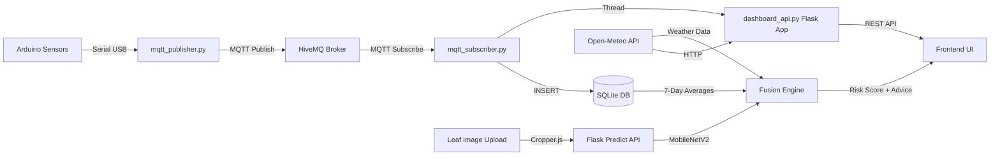

<p align="center">
  
</p>

<h1 align="center">🌿 CropGuard AI</h1>
<p align="center">
  <b>Intelligent Plant Disease Detection &amp; IoT Soil Health Monitoring System</b>
</p>

<p align="center">
  
  
  
  
  
  
</p>

---

## 📖 Overview

**CropGuard AI** is a full-stack agricultural intelligence platform that combines **deep learning-based plant disease detection** with **real-time IoT soil monitoring** and **external weather data** to deliver actionable farming insights.

The system fuses three data sources — an **AI image classifier**, **live Arduino sensor readings**, and **Open-Meteo weather forecasts** — through a rule-based **Fusion Engine** that produces crop-specific risk scores, treatment plans, and irrigation recommendations.

Recently upgraded from a Streamlit prototype to a **fully unified, production-ready Flask Web Application**, CropGuard AI now features a responsive, dynamic UI with direct hardware connectivity right from your browser.

### ✨ Key Features

| Feature | Description |
|---|---|
| 🔬 **AI Disease Detection** | Client-side image cropping + server-side MobileNetV2 classification |
| 🔌 **Web Serial Connect** | Browser-level hardware connection filters & reads Arduino USB directly |
| 📡 **Live IoT Monitoring** | Robust Python background publisher auto-detects ports & heals from unplug/replug events |
| 🌦️ **Dynamic Weather** | Uses Browser Geolocation GPS to pull hyper-local real-time weather & AQI dynamically |
| 🧬 **Fusion Engine** | Cross-references disease diagnosis with 7-day sensor trends + weather to generate risk scores |
| 📊 **Interactive Dashboard** | Custom HTML/JS/CSS with real-time Chart.js graphs, gauge cards & threshold alerts |
| 📄 **Report Generation** | Export sensor data as CSV or professional PDF reports from the dashboard |
| 🗃️ **Auto Data Retention** | Background thread purges records older than 7 days and auto-vacuums the database |

---

## 🏗️ System Architecture

```text
┌─────────────────────────────────────────────────────────────────┐
│                        CropGuard AI System                      │
├─────────────┬──────────────────┬────────────────────────────────┤
│  HARDWARE   │    BACKEND       │         FRONTEND               │
│             │                  │                                │
│  Arduino    │  mqtt_publisher  │  Flask Web Dashboard (HTML/JS) │
│  Uno R3     │  ──► Serial ──►  │  ┌──────────────────────────┐  │
│  ┌────────┐ │  ──► MQTT ───►   │  │ 🌿 Live Soil Monitor     │  │
│  │ DHT11  │ │                  │  │ 🔬 Disease Detection     │  │
│  │ HL-69  │ │  mqtt_subscriber │  │ 📄 History & Reports     │  │
│  │ LED    │ │  ◄── MQTT ◄──    │  │ ⚙️ Preferences           │  │
│  │ Buzzer │ │  ──► SQLite ──►  │  └──────────────────────────┘  │
│  └────────┘ │                  │                                │
│             │  dashboard_api   │  Client-Side Technologies      │
│             │  (Flask REST)    │  ┌──────────────────────────┐  │
│             │  ◄── HTTP/WS ◄── │  │ 📈 Chart.js (Graphs)     │  │
│             │                  │  │ ✂️ Cropper.js (Images)   │  │
│             │  fusion_engine   │  │ 🔌 Web Serial API        │  │
│             │  (Rule-based AI) │  │ 📍 Geolocation API       │  │
│             │                  │  └──────────────────────────┘  │
└─────────────┴──────────────────┴────────────────────────────────┘
```

### Data Flow



---

## 📁 Project Structure

```text
plant_disease_iot_v3/
│
├── run_all.py                      # 🚀 Master launcher — starts services
├── requirements.txt                # Python dependencies
├── .env                            # Environment variables
├── .gitignore                      # Git exclusions
│
├── plant_disease_model_new.keras   # 🧠 Trained MobileNetV2 model
├── label_encoder_new.joblib        # 🏷️ Label encoder for disease classes
│
├── backend/
│   ├── __init__.py
│   ├── mqtt_subscriber.py          # MQTT listener + DB writer + Flask launcher
│   ├── dashboard_api.py            # Primary Flask App & REST endpoints
│   └── fusion_engine.py            # Disease + Soil + Weather logic
│
├── frontend/
│   ├── static/
│   │   ├── css/dashboard.css       # Unified dark-themed design system
│   │   └── js/app.js               # Frontend logic (charts, API fetching, USB Serial)
│   └── templates/
│       ├── base.html               # Master layout with sidebar
│       ├── soil.html               # Live telemetry & charts
│       ├── disease.html            # Image upload & AI prediction
│       ├── history.html            # Data tables & CSV export
│       └── preferences.html        # Settings configuration
│
├── iot/
│   ├── arduino_sensor.ino          # Arduino firmware (DHT11 + HL-69)
│   └── mqtt_publisher.py           # Serial reader → MQTT publisher
│
├── soil_data.db                    # 🗃️ SQLite database (auto-created)
└── *.log                           # Auto-rotating log files
```

---

## ⚙️ Hardware Requirements

| Component | Model | Pin | Purpose |
|---|---|---|---|
| **Microcontroller** | Arduino Uno R3 | — | Central controller |
| **Temp/Humidity Sensor** | DHT11 | D2 | Air temperature & humidity |
| **Soil Moisture Sensor** | HL-69 (Analog) | A0 | Soil moisture level (0–100%) |
| **Alert LED** | Standard LED | D8 | Visual alert indicator |
| **Alert Buzzer** | Passive Buzzer | D9 | Audible alert |

---

## 🚀 Getting Started

### Prerequisites

- **Python 3.10+** with `pip`
- **Arduino IDE** (to flash the firmware)
- **Arduino Uno R3** with sensors connected
- **USB Cable** connecting Arduino to your machine
- **Google Chrome or Edge** (required for Web Serial API features)

### 1. Clone & Setup Environment

```bash
git clone <your-repo-url>
cd plant_disease_iot_v3
python -m venv .venv
source .venv/bin/activate        # Linux/macOS
# .venv\Scripts\activate         # Windows
pip install -r requirements.txt
```

### 2. Flash Arduino Firmware

1. Open `iot/arduino_sensor.ino` in **Arduino IDE**
2. Install the **DHT sensor library** (by Adafruit) via Library Manager
3. Select **Arduino Uno** board and the correct serial port
4. Click **Upload**

### 3. Launch the System

```bash
python run_all.py
```

This single command starts:
1. `mqtt_subscriber.py` — The MQTT listener, SQLite DB manager, and the embedded **Flask API server** (Port 5000).
2. `mqtt_publisher.py` — The background hardware scanner that bridges Arduino Serial to the cloud.

### 4. Access the Dashboard

Open your browser (Chrome/Edge recommended) to:
**[https://cropguard-ai-1-ys7p.onrender.com](https://cropguard-ai-1-ys7p.onrender.com)**

---

## 📡 API Reference

All REST endpoints are served by the Flask API on **port 5000**.

| Method | Endpoint | Description |
|---|---|---|
| `GET` | `/api/sensor` | Latest sensor reading + connection status |
| `POST` | `/api/sensor/upload` | Upload dynamic Web Serial client sensor readings to SQLite |
| `POST` | `/api/predict` | Run MobileNetV2 inference on an uploaded image crop |
| `GET` | `/api/history?hours=N` | Sensor history (max 168h / 7 days) |
| `GET` | `/api/weather?lat=X&lon=Y` | Local weather, hourly/daily forecasts |
| `GET` | `/api/insights?lat=X&lon=Y` | Rule-based crop insights with health score |
| `GET` | `/api/thresholds` | Current alert thresholds |
| `POST` | `/api/thresholds` | Update alert thresholds |
| `GET` | `/api/calibration` | Current sensor calibration offsets |
| `POST` | `/api/calibration` | Update calibration offsets |
| `GET` | `/api/export/csv?hours=N` | Download sensor data as CSV |
| `GET` | `/api/export/pdf?hours=N` | Download full PDF report |

---

## 🧪 Tech Stack

| Layer | Technology |
|---|---|
| **AI Model** | TensorFlow/Keras (MobileNetV2), OpenCV |
| **Backend Web Framework** | Flask, Jinja2, Flask-CORS |
| **Frontend Utilities** | Chart.js, Cropper.js, Web Serial API, Geolocation API |
| **IoT Hardware** | Arduino Uno R3, DHT11, HL-69 Soil Sensor |
| **Communication** | MQTT (paho-mqtt) via HiveMQ public broker |
| **Serial I/O** | PySerial (9600 baud) |
| **Database** | SQLite3 |
| **Weather** | Open-Meteo API (free, no key) |
| **Styling** | Custom Vanilla CSS (Glassmorphism, CSS Variables) |

---

## 📄 License

This project is for educational and research purposes.

---

<p align="center">
  Built with 💚 for smarter agriculture
</p>
