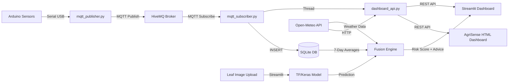

<p align="center">
  
</p>

<h1 align="center">🌿 CropGuard AI</h1>
<p align="center">
  <b>Intelligent Plant Disease Detection &amp; IoT Soil Health Monitoring System</b>
</p>

<p align="center">
  
  
  
  
  
  
</p>

---

## 📖 Overview

**CropGuard AI** is a full-stack agricultural intelligence platform that combines **deep learning-based plant disease detection** with **real-time IoT soil monitoring** and **external weather data** to deliver actionable farming insights.

The system fuses three data sources — an **AI image classifier**, **live Arduino sensor readings**, and **Open-Meteo weather forecasts** — through a rule-based **Fusion Engine** that produces crop-specific risk scores, treatment plans, and irrigation recommendations.

### ✨ Key Features

| Feature | Description |
|---|---|
| 🔬 **AI Disease Detection** | Upload a leaf photo → MobileNetV2 model classifies disease with top-3 predictions |
| 🔌 **Web Serial Connect** | Browser-level hardware connection filters & reads Arduino USB directly with auto-reconnects |
| 📡 **Live IoT Monitoring** | Robust Python background publisher auto-detects ports & heals from unplug/replug events |
| 🌦️ **Dynamic Weather** | Uses Browser Geolocation GPS to pull hyper-local real-time weather & AQI dynamically |
| 🧬 **Fusion Engine** | Cross-references disease diagnosis with 7-day sensor trends + weather to generate risk scores |
| 📊 **Interactive Dashboard** | Glassmorphic HTML dashboard with real-time charts, gauge cards & threshold alerts |
| 📄 **Report Generation** | Export sensor data as CSV or professional PDF reports from the dashboard |
| 🗃️ **Auto Data Retention** | Background thread purges records older than 7 days and auto-vacuums the database |
| 🔧 **Configurable** | Adjustable alert thresholds, sensor calibration offsets, and weather city from the UI |

---

## 🏗️ System Architecture

```
┌─────────────────────────────────────────────────────────────────┐
│                        CropGuard AI System                      │
├─────────────┬──────────────────┬────────────────────────────────┤
│  HARDWARE   │    BACKEND       │         FRONTEND               │
│             │                  │                                │
│  Arduino    │  mqtt_publisher  │  Streamlit Dashboard (app.py)  │
│  Uno R3     │  ──► Serial ──►  │  ┌──────────────────────────┐  │
│  ┌────────┐ │  ──► MQTT ───►   │  │ 🔬 Disease Detection    │  │
│  │ DHT11  │ │                  │  │ 🌱 Soil Monitor (iframe) │  │
│  │ HL-69  │ │  mqtt_subscriber │  │ 📄 History & Reports     │  │
│  │ LED    │ │  ◄── MQTT ◄──    │  │ ⚙️ Preferences           │  │
│  │ Buzzer │ │  ──► SQLite ──►  │  └──────────────────────────┘  │
│  └────────┘ │                  │                                │
│             │  dashboard_api   │  AgriSense Dashboard (HTML/JS) │
│             │  (Flask REST)    │  ┌──────────────────────────┐  │
│             │  ◄── HTTP ◄──    │  │ 🌿 Your Field (Live)    │  │
│             │                  │  │ 📈 Sensor History Charts │  │
│             │  fusion_engine   │  │ 🌦️ Weather Dashboard    │  │
│             │  (Rule-based AI) │  │ 🧠 AI Insights          │  │
│             │                  │  │ 📁 CSV/PDF Reports      │  │
│             │                  │  └──────────────────────────┘  │
└─────────────┴──────────────────┴────────────────────────────────┘
```

### Data Flow



---

## 📁 Project Structure

```
plant_disease_iot_v3/
│
├── run_all.py                      # 🚀 Master launcher — starts all 3 services
├── requirements.txt                # Python dependencies
├── config.json                     # Persistent config (weather city)
├── .gitignore                      # Git exclusions
│
├── plant_disease_model_new.keras   # 🧠 Trained MobileNetV2 model (~12 MB)
├── label_encoder_new.joblib        # 🏷️ Label encoder for disease classes
│
├── backend/
│   ├── __init__.py
│   ├── mqtt_subscriber.py          # MQTT subscriber + DB writer + API launcher
│   ├── dashboard_api.py            # Flask REST API (sensor, weather, insights, export)
│   └── fusion_engine.py            # Disease + Soil + Weather fusion logic
│
├── frontend/
│   ├── app.py                      # Streamlit multi-page dashboard
│   ├── agrisense.html              # Standalone HTML dashboard (served by Flask)
│   └── static/
│       ├── css/
│       │   └── style.css           # Full CSS design system (glassmorphic weather UI)
│       └── js/
│           └── app.js              # Dashboard interactivity (charts, fetch, navigation)
│
├── iot/
│   ├── arduino_sensor.ino          # Arduino firmware (DHT11 + HL-69 + LED + Buzzer)
│   └── mqtt_publisher.py           # Serial reader → MQTT publisher
│
├── soil_data.db                    # 🗃️ SQLite database (auto-created, gitignored)
├── publisher.log                   # 📋 MQTT publisher logs (auto-rotated, 5MB max)
└── subscriber.log                  # 📋 MQTT subscriber logs (auto-rotated, 5MB max)
```

---

## ⚙️ Hardware Requirements

| Component | Model | Pin | Purpose |
|---|---|---|---|
| **Microcontroller** | Arduino Uno R3 | — | Central controller |
| **Temp/Humidity Sensor** | DHT11 | D2 | Air temperature & humidity |
| **Soil Moisture Sensor** | HL-69 (Analog) | A0 | Soil moisture level (0–100%) |
| **Alert LED** | Standard LED | D8 | Visual alert indicator |
| **Alert Buzzer** | Passive Buzzer | D9 | Audible alert |

### Wiring Diagram

```
Arduino Uno R3
├── D2  ──── DHT11 Data Pin
├── D8  ──── LED (+) → 220Ω Resistor → GND
├── D9  ──── Buzzer (+) → GND
├── A0  ──── HL-69 Analog Output
├── 5V  ──── DHT11 VCC, HL-69 VCC
└── GND ──── DHT11 GND, HL-69 GND, LED(-), Buzzer(-)
```

---

## 🚀 Getting Started

### Prerequisites

- **Python 3.10+** with `pip`
- **Arduino IDE** (to flash the firmware)
- **Arduino Uno R3** with sensors connected (see hardware section)
- **USB Cable** connecting Arduino to your machine

### 1. Clone the Repository

```bash
git clone <your-repo-url>
cd plant_disease_iot_v3
```

### 2. Create Virtual Environment

```bash
python -m venv .venv
source .venv/bin/activate        # Linux/macOS
# .venv\Scripts\activate         # Windows
```

### 3. Install Dependencies

```bash
pip install -r requirements.txt
```

> **Note**: TensorFlow is a large dependency (~500MB+). Install may take several minutes.

### 4. Flash Arduino Firmware

1. Open `iot/arduino_sensor.ino` in **Arduino IDE**
2. Install the **DHT sensor library** (by Adafruit) via Library Manager
3. Select **Arduino Uno** board and the correct serial port
4. Click **Upload**

The Arduino will begin printing JSON sensor data over Serial at 9600 baud:

```json
{"device_id":"cropguard_basic","time_ms":12000,"temperature":27.2,"humidity":81.0,"soil_raw":450,"soil_moisture":56.0,"soil_dry":false,"temp_high":false,"humidity_low":false}
```

### 5. Configure Serial Port

The system now features **Auto-Detection**! The publisher (`iot/mqtt_publisher.py`) will automatically scan and connect to any active Arduino (`/dev/ttyACM*` or `/dev/ttyUSB*`). 

If you need to force a specific port, you can manually edit `iot/mqtt_publisher.py`:

```python
SERIAL_PORT = "/dev/ttyACM1"    # Hardcoded fallback if auto-detect fails
```

> **Hot-Plugging**: The system supports live unplugging and replugging. If the USB cable is disconnected, the server will pause and seamlessly reconnect once it is plugged back in.

### 6. Launch the System

```bash
python run_all.py
```

This single command starts **all three services** in sequence:

| Service | Description | Port |
|---|---|---|
| `mqtt_subscriber.py` | MQTT listener + SQLite writer + Flask API | `5000` |
| `mqtt_publisher.py` | Arduino serial reader → MQTT publisher | — |
| `app.py` (Streamlit) | Full Streamlit dashboard | `8501` |

You should see output like:

```
========================================
🌿 Starting CropGuard AI System
========================================
[1/3] Starting MQTT Subscriber & API Server...
[2/3] Starting MQTT Publisher (Serial to MQTT)...
[3/3] Starting Streamlit Dashboard...

✅ All systems are running! Press Ctrl+C to shut down cleanly.
```

### 7. Access the Dashboards

| Dashboard | URL | Description |
|---|---|---|
| **Streamlit Dashboard** | [http://localhost:8501](http://localhost:8501) | Disease detection, soil monitor, history, settings |
| **AgriSense Dashboard** | [http://localhost:5000](http://localhost:5000) | Real-time sensor cards, charts, weather, reports |

---

## 📡 API Reference

All REST endpoints are served by the Flask API on **port 5000**.

| Method | Endpoint | Description |
|---|---|---|
| `GET` | `/api/sensor` | Latest sensor reading + connection status |
| `POST` | `/api/sensor/upload` | Upload dynamic Web Serial client sensor readings to SQLite |
| `GET` | `/api/history?hours=N` | Sensor history (max 168h / 7 days) |
| `GET` | `/api/weather?lat=X&lon=Y` | Local weather, hourly/daily forecasts (auto-detects GPS via browser) |
| `GET` | `/api/insights?lat=X&lon=Y` | Rule-based crop insights with health score |
| `GET` | `/api/thresholds` | Current alert thresholds |
| `POST` | `/api/thresholds` | Update alert thresholds |
| `GET` | `/api/calibration` | Current sensor calibration offsets |
| `POST` | `/api/calibration` | Update calibration offsets |
| `GET` | `/api/config` | Current config (city fallback if GPS disabled) |
| `POST` | `/api/config` | Update config (city fallback) |
| `GET` | `/api/export/csv?hours=N` | Download sensor data as CSV |
| `GET` | `/api/export/pdf?hours=N` | Download full PDF report |

### Example: Get Latest Sensor Data

```bash
curl http://localhost:5000/api/sensor
```

```json
{
  "soil_moisture": 56.2,
  "temperature": 27.2,
  "humidity": 81.0,
  "timestamp": "2026-05-01T18:15:07+00:00",
  "connected": true
}
```

---

## 🧬 Fusion Engine

The **Fusion Engine** (`backend/fusion_engine.py`) is the core intelligence layer that cross-references three data sources:

1. **AI Disease Prediction** — disease label + confidence from the MobileNetV2 model
2. **IoT Sensor Data** — 7-day rolling averages of temperature, humidity, soil moisture
3. **Weather Forecast** — precipitation probability, rain volume, pressure trends

### How It Works

```
Disease Prediction ──┐
                     ├──► Condition Classifier ──► Risk Score Calculator
Sensor 7-Day Avg ───┤                                    │
                     │                                    ▼
Weather Forecast ────┘                          FusionResult
                                                ├── alert_level (critical/high/medium/low)
                                                ├── risk_score (0–100)
                                                ├── combined_insight
                                                ├── immediate_actions[]
                                                ├── treatment[]
                                                ├── prevention[]
                                                ├── irrigation_fix
                                                └── fertiliser_fix
```

### Supported Crops & Diseases

| Crop | Diseases |
|---|---|
| 🍅 **Tomato** | Late Blight, Early Blight, Bacterial Spot, Healthy |
| 🥔 **Potato** | Late Blight, Early Blight |
| 🍎 **Apple** | Apple Scab, Black Rot |
| 🫑 **Pepper** | Bacterial Spot |

Each disease has a **knowledge base entry** with:
- Alert severity level
- Environmental trigger conditions (e.g., `high_moisture`, `cool_temp`, `rain_incoming`)
- Specific treatment protocols with chemical recommendations
- Prevention strategies

---

## 🗄️ Database Schema

The system uses **SQLite** (`soil_data.db`) with three tables:

### `soil_readings`
Stores all incoming sensor data from the Arduino.

| Column | Type | Description |
|---|---|---|
| `id` | INTEGER PK | Auto-increment ID |
| `device_id` | TEXT | Device identifier (`cropguard_01`) |
| `timestamp` | TEXT | UTC ISO 8601 timestamp |
| `temperature` | REAL | Temperature in °C |
| `humidity` | REAL | Relative humidity % |
| `soil_moisture` | REAL | Soil moisture % (0–100) |
| `soil_dry` | INTEGER | 1 if soil below threshold |
| `soil_wet` | INTEGER | 1 if soil above threshold |
| `created_at` | TEXT | Row creation time |

### `disease_predictions`
Logs every AI diagnosis from the Streamlit dashboard.

| Column | Type | Description |
|---|---|---|
| `disease` | TEXT | Predicted disease name |
| `crop` | TEXT | Detected crop type |
| `confidence` | REAL | Model confidence (0–100%) |
| `severity` | TEXT | Severity level |

### `recommendations`
Stores fusion engine output for historical analysis.

| Column | Type | Description |
|---|---|---|
| `disease` | TEXT | Disease that triggered the recommendation |
| `soil_score` | INTEGER | Computed risk score (0–100) |
| `alert_level` | TEXT | Alert level (critical/high/medium/low) |
| `recommendation` | TEXT | JSON array of treatment steps |
| `soil_fix` | TEXT | Irrigation recommendation |

> **Data Retention**: Records older than 7 days are automatically purged every 6 hours by a background thread. The database is vacuumed after each cleanup.

---

## 🌦️ Weather Integration

The dashboard integrates with the free **Open-Meteo API** (no API key required) to provide:

- **Current Conditions**: Temperature, feels-like, humidity, wind, cloud cover, UV index
- **24-Hour Hourly Forecast**: Temperature, precipitation probability, weather codes
- **7-Day Daily Forecast**: High/low temps, sunrise/sunset, UV index
- **Air Quality (AQI)**: PM2.5, PM10, US AQI rating
- **Severe Weather Alerts**: Automated thunderstorm and heavy rain warnings
- **Pressure Trend**: 3-hour barometric pressure change rate

The weather city is configurable from the Preferences page or via the `config.json` file.

---

## 🔧 Configuration

### Alert Thresholds (via UI or API)

| Metric | Default Min | Default Max |
|---|---|---|
| Soil Moisture | 30% | 80% |
| Temperature | 10°C | 35°C |
| Humidity | 40% | 80% |

### Sensor Calibration

Calibration offsets can be applied to correct systematic sensor errors:

```json
{
  "soil_moisture": 0.0,
  "temperature": 0.0,
  "humidity": 0.0
}
```

### Weather City

```json
// config.json
{
  "city": "Nabadwip"
}
```

---

## 🛠️ Running Individual Components

You can run each component independently for debugging:

```bash
# Start only the MQTT subscriber + API server
python backend/mqtt_subscriber.py

# Start only the MQTT publisher (requires Arduino connected)
python iot/mqtt_publisher.py

# Start only the Streamlit dashboard
streamlit run frontend/app.py

# Test the fusion engine standalone
python backend/fusion_engine.py
```

---

## 📝 Logging

Both the publisher and subscriber use **rotating file handlers**:

| Log File | Max Size | Backups | Content |
|---|---|---|---|
| `publisher.log` | 5 MB | 3 | Serial reads, MQTT publishes, errors |
| `subscriber.log` | 5 MB | 3 | MQTT messages, DB writes, data retention |

Logs are automatically rotated when they reach the size limit. Old log files are kept as `.log.1`, `.log.2`, `.log.3`.

---

## 🧪 Tech Stack

| Layer | Technology |
|---|---|
| **AI Model** | TensorFlow/Keras (MobileNetV2), OpenCV, scikit-learn |
| **IoT Hardware** | Arduino Uno R3, DHT11, HL-69 Soil Sensor |
| **Communication** | MQTT (paho-mqtt) via HiveMQ public broker |
| **Serial I/O** | PySerial (9600 baud) |
| **Backend API** | Flask + Flask-CORS |
| **Database** | SQLite3 |
| **Frontend (Main)** | Streamlit with Plotly charts |
| **Frontend (Sensor)** | Vanilla HTML/CSS/JS with Chart.js |
| **Weather** | Open-Meteo API (free, no key) |
| **PDF Reports** | ReportLab |
| **Styling** | Custom CSS (Outfit font, glassmorphism) |

---

## 📄 License

This project is for educational and research purposes.

---

<p align="center">
  Built with 💚 for smarter agriculture
</p>
